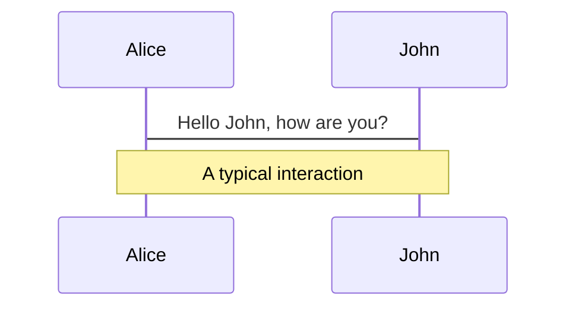
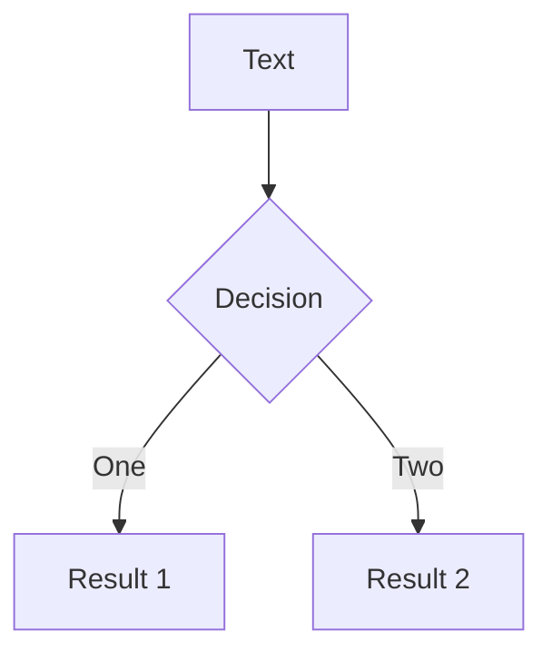

<div class="flex justify-center">
  <logos-vue class="text-6xl" />
</div>
 

# <span> Vue Masterclass <small>(with Ayman)</small> </span>

Presentation slides for developers

<div class="pt-12">
  <span @click="$slidev.nav.next" class="px-2 py-1 rounded cursor-pointer" hover="bg-white bg-opacity-10">
    Let's Begin <carbon:arrow-right class="inline"/>
  </span>
</div>

<div class="abs-br m-6 flex gap-2">
  <a href="https://github.com/alimirayman/upskill-vue-initial" target="_blank" alt="GitHub"
    class="text-xl icon-btn opacity-50 !border-none !hover:text-white">
    <carbon-logo-github />
  </a>
</div>

<!--
The last comment block of each slide will be treated as slide notes. It will be visible and editable in Presenter Mode along with the slide. [Read more in the docs](https://sli.dev/guide/syntax.html#notes)
-->

---
layout: cover

---
<div class="flex justify-center">
  <div class="rounded-full h-32 w-32 flex items-center justify-center bg-cover" style="background-image: url('https://avatars.githubusercontent.com/u/3832930?v=4')">
  </div>
</div>

## Mir Ayman Ali

<div class="flex justify-center gap-2">
  <a href="https://github.com/alimirayman" target="_blank" alt="GitHub"
    class="text-xl icon-btn opacity-50 !border-none !hover:text-white">
    <carbon-logo-github />
  </a>
  <a href="https://www.linkedin.com/in/alimirayman/" target="_blank" alt="LinkedIn"
    class="text-xl icon-btn opacity-50 !border-none !hover:text-white">
    <carbon-logo-linkedin />
  </a>
</div>


---

<div class="flex justify-start align-center"> 
  <h1>Why Vue JS?</h1>
  <logos-vue class="text-4xl pl-3" />
</div>

The Progressive JavaScript Framework

- 🚀 **Easier Learning Curve** - Easy to get in, learn and Impliment
- 🤡 **Simple** - Easy to use
- 📝 **Awesome Documentation** - Can learn just by going through the docs
- ⚡️ **High Performance** - Page loads very fast 😜
- 👥 **Vibrant Community** - Huge communnity so you don't feel stuck
- 🕸 **SPA / SSR** - Single Page Application & Server Side Renderinng

<br>
<br>

Read more about [Vue](https://vuejs.org/)

---

# Why this Course?

- Learn deep into frontend
- Potential job opportunity
- Learn from a prefessional

<br>
<br>

---
layout: section
---

# Code

---

# Basic Vue File (.vue)

```html {all|1-3|4-7|9-12|all}
<template>
  <!-- html -->
</template>

<script>
export default {
// JS
}
</script>

<style>
/* CSS */
</style>
```

<style>
/* .footnotes-sep {
  @apply mt-20 opacity-10;
}
.footnotes {
  @apply text-sm opacity-75;
}
.footnote-backref {
  display: none;
} */
</style>

---

# Basic Vue File (.vue)

```html 
<div class="flex justify-around mt-6 text-sm mx-20">
  <div class="bg-gradient-to-r from-green-400 to-blue-500 hover:from-pink-500 hover:to-yellow-500 p-2 rounded" v-click>
    Senior Software Engineer
    @
    <a href="https://www.obviously.ai/" target="_blank">Obviously.ai</a>
  </div>
  <div class="bg-gradient-to-r from-green-400 to-blue-500 hover:from-pink-500 hover:to-yellow-500 p-2 rounded" v-click>
    Co-Founder | CEO
    @
    <a href="https://shastho.ai/" target="_blank">Shastho.ai</a>
  </div>
</div>
```

<div class="flex justify-around text-sm mx-20">
  <div class="bg-gradient-to-r from-green-400 to-blue-500 hover:from-pink-500 hover:to-yellow-500 p-2 rounded" >
    Senior Software Engineer
    @
    <a href="https://www.obviously.ai/" target="_blank">Obviously.ai</a>
  </div>
  <div class="bg-gradient-to-r from-green-400 to-blue-500 hover:from-pink-500 hover:to-yellow-500 p-2 rounded" >
    Co-Founder | CEO
    @
    <a href="https://shastho.ai/" target="_blank">Shastho.ai</a>
  </div>
</div>

<style>
/* .footnotes-sep {
  @apply mt-20 opacity-10;
}
.footnotes {
  @apply text-sm opacity-75;
}
.footnote-backref {
  display: none;
} */
</style>

---
# Basic Vue File (.vue)

---

# Components

<div grid="~ cols-2 gap-4">
<div>

You can use Vue components directly inside your slides.

We have provided a few built-in components like `<Tweet/>` and `<Youtube/>` that you can use directly. And adding your custom components is also super easy.

```html
<Counter :count="10" />
```

<!-- ./components/Counter.vue -->
<Counter :count="10" m="t-4" />

Check out [the guides](https://sli.dev/builtin/components.html) for more.

</div>
<div>

```html
<Tweet id="1407635397887287298" />
```

<Tweet id="1407635397887287298" scale="0.65" />

</div>
</div>


---
class: px-20
---

# Themes

Slidev comes with powerful theming support. Themes can provide styles, layouts, components, or even configurations for tools. Switching between themes by just **one edit** in your frontmatter:

<div grid="~ cols-2 gap-2" m="-t-2">

```yaml
---
theme: default
---
```

```yaml
---
theme: seriph
---
```


</div>

Read more about [How to use a theme](https://sli.dev/themes/use.html) and
check out the [Awesome Themes Gallery](https://sli.dev/themes/gallery.html).

---
preload: false
---

# Animations

Animations are powered by [@vueuse/motion](https://motion.vueuse.org/).

```html
<div
  v-motion
  :initial="{ x: -80 }"
  :enter="{ x: 0 }">
  Slidev
</div>
```

<div class="w-60 relative mt-6">
  <div class="relative w-40 h-40">
    
    
    
  </div>

  <div 
    class="text-5xl absolute top-14 left-40 text-[#2B90B6] -z-1"
    v-motion
    :initial="{ x: -80, opacity: 0}"
    :enter="{ x: 0, opacity: 1, transition: { delay: 2000, duration: 1000 } }">
    Slidev
  </div>
</div>

<!-- vue script setup scripts can be directly used in markdown, and will only affects current page -->
<script setup lang="ts">
const final = {
  x: 0,
  y: 0,
  rotate: 0,
  scale: 1,
  transition: {
    type: 'spring',
    damping: 10,
    stiffness: 20,
    mass: 2
  }
}
</script>

<div
  v-motion
  :initial="{ x:35, y: 40, opacity: 0}"
  :enter="{ y: 0, opacity: 1, transition: { delay: 3500 } }">

[Learn More](https://sli.dev/guide/animations.html#motion)

</div>

---

# LaTeX

LaTeX is supported out-of-box powered by [KaTeX](https://katex.org/).

<br>

Inline $\sqrt{3x-1}+(1+x)^2$

Block
$$
\begin{array}{c}

\nabla \times \vec{\mathbf{B}} -\, \frac1c\, \frac{\partial\vec{\mathbf{E}}}{\partial t} &
= \frac{4\pi}{c}\vec{\mathbf{j}}    \nabla \cdot \vec{\mathbf{E}} & = 4 \pi \rho \\

\nabla \times \vec{\mathbf{E}}\, +\, \frac1c\, \frac{\partial\vec{\mathbf{B}}}{\partial t} & = \vec{\mathbf{0}} \\

\nabla \cdot \vec{\mathbf{B}} & = 0

\end{array}
$$

<br>

[Learn more](https://sli.dev/guide/syntax#latex)

---

# Diagrams

You can create diagrams / graphs from textual descriptions, directly in your Markdown.

<div class="grid grid-cols-2 gap-10 pt-4 -mb-6">





</div>

[Learn More](https://sli.dev/guide/syntax.html#diagrams)


---
layout: center
class: text-center
---

# Learn More

[Documentations](https://sli.dev) · [GitHub](https://github.com/slidevjs/slidev) · [Showcases](https://sli.dev/showcases.html)
